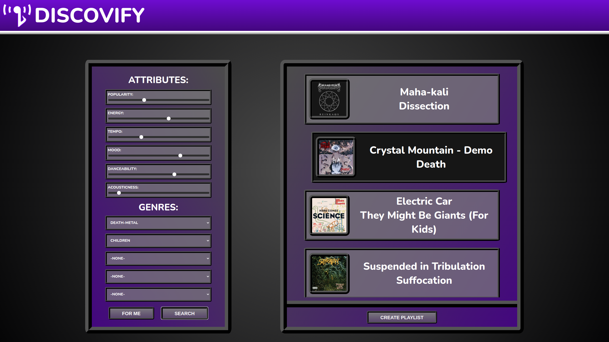

# DISCOVIFY

### LIVE SITE: https://discovify-57edf8e39469.herokuapp.com/#

DISCOVIFY is a React-based music recommendation that makes heavy use of Spotify's web api. Users can authenticate using a Spotify account, and can then search for music based on several parameters, or alternatively, have a search made for you, based on your profile's most streamed songs. Songs can be viewed individualy by clicking on them, and if desired, a playlist can be created with these results by simply pressing its respective button underneath the recommendations.

## TECH USED

### Languages:

- JavaScript
- HTML
- CSS

### Frameworks/Libraries/APIs:

- React
- Spotify Web API

### Software/Services:

- VSCodium
- Figma
- Heroku

## HOW TO USE

### Signing In:
Upon opening the app, you will be prompted to authenticate with your Spotify account. After doing so, you will be greeted with a search panel on the left, and a results panel on the right.

### Searching:
In the search panel, you can fine-tune what you're looking for based on different song features and genres. Alternatively, you can simply press "FOR ME" to have a list of songs curated to your specific tastes fill the results panel. The "FOR ME" recommendations are searched with an average of each parameter in your 20 most listened to songs, and then additionally seeded with your 20 most listened to artists.

### Recommendation Results: 
Once recommendations are visible, you can scroll through the results panel on the right to view them, clicking on a song will take you to that song's Spotify page, and if you desire, you can click the "CREATE PLAYLIST" button below, to turn your recommendations into a Spotify playlist on your account for you to easily listen to. (These playlists are private by default, but can be made public from your Spotify account)

## ICEBOX FEATURES

In the future, I intend to add:

- Timeframe length filtering for a user's personalized recommendations
- The ability to search for more media types than just songs (albums, artists, podcasts, etc)
- The option to disable individual sliders if a user has no preference on a certain song attribute
- The ability to search for non-personalized music without authenticating
- A delay for the playlist button, to help prevent accidentally making the same one multiple times
- A brief css animation for loading in song recommendations
- Fitler song popularity by artist popularity instead, as the current song popularity parameter only takes the popularity of a song relative to its artist's other songs
- The ability to use the web player API to sample recommended songs
- A more polished and professional looking UI
- More variation in the personalized song recommendations
- A responsive UI

## CREATION

This project was developed in a one week sprint as a capstone project for my bootcamp. The original intention was to use Django rather than react, however, after considering the ambitiousness of my ideas, being slightly newer to Django, and the short timeframe allotted, I decided about midway through the sprint to swtich to JavaScript, and dedicate another project to learning the DR stack more thoroughly. 

Interfacing with the API was by far the biggest time sink for me. It took quite a while for me to piece together how it all worked, but it was immensely satisfying each time one of my functions would finally successfully resolve.

I took a lot more care into refining my wireframes for this project, and I think it served me very well, allowing me to hide elements I originally intended to be in the original release, but didn't quite have time for, in a way that's as easy as uncommenting a few components and getting back to work on them.

Overall I'm quite proud of this project and I learned a lot in a very short timespan. I'm excited to build more features out and to polish the UI further.

## UPDATE LOG

### 12/21/2023 Original Sprint Finished - v1.0:
- Basic features implemented over one-week sprint

## KNOWN ISSUES

- The border above the playlist button cuts off part of any song card intersecting with it.
