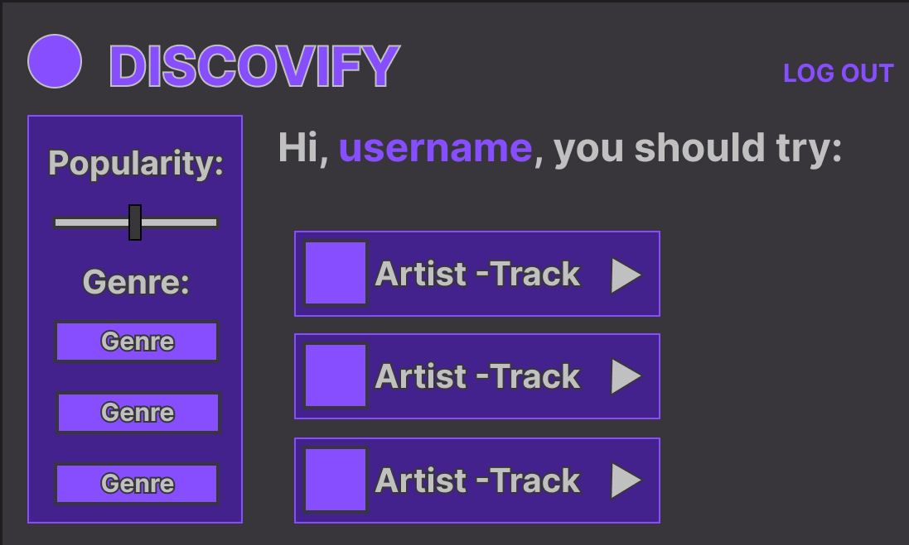
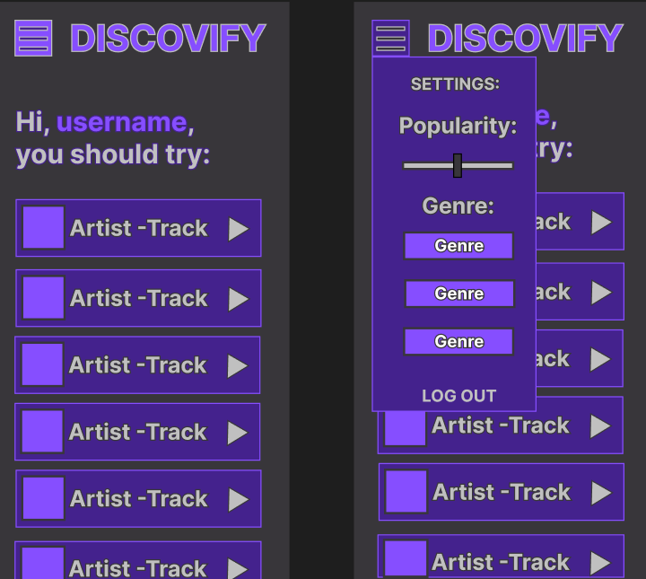
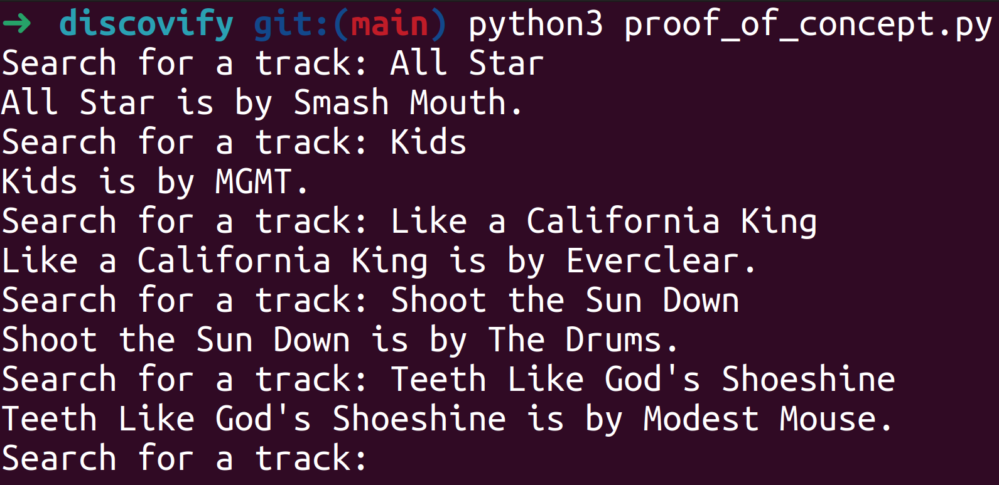

# DISCOVIFY
Discovify is designed to help you discover new music by using your Spotify profile to establish music recommendations.

## WIREFRAMES:

### Desktop:

### Mobile:

## PROOF OF CONCEPT:

Above is a screenshot of a successful interface with the Spotify Web API, allowing an artist to be searched for by a track name.

## TECH USED:

### Languages:
- JavaScript
- HTML
- CSS

### Frameworks/Libraries/APIs:
- React
- Spotify Web API

### Software:
- VSCodium
- Figma

## MVP:
To successfully meet MVP, this project will need:
- Successful integration of the Spotify Web API
- Successful React-Django Integration
- System for weighting different search parameters (genre, popularity, etc)
- User authentication with the Spotify API
- Implement links to songs listed
- Interfacing with Spotify recommendation feature

## STRETCH GOALS:
If time permits, I would like to add:
- More search parameters
- Save recommended tracks to playlist
- Recommend more than just tracks (albums, artists, etc)
- Implement the Spotify Web Player API
- Improve the front-end UI

## USER FLOW:
When using this application, users will:
- Be prompted to sign into their Spotify Profile
- Select settings based on their preferences
- Press search button to update/refresh results
- View links and information about recommended songs

## USER STORIES:
AAU, I want to:
- Easily sign into my Spotify account
- Discover new music with an intuitive UI
- filter music results to Fine-tune what I'm in the mood for
- Gain easy access to recommended tracks

## SPRINT BREAKDOWN:
A brief plan for the 7-day development cycle:

- Day 1: Create Authentication System
- Day 2: Create Basic UI & Reccomendation System
- Day 3: Improve UI
- Day 4: Improve Filtering System / Reach MVP
- Day 5: Polish / Bug Fix
- Day 6: Polish
- Day 7: Unplanned/Leeway for any unforseen issues that could arise in the development cycle
